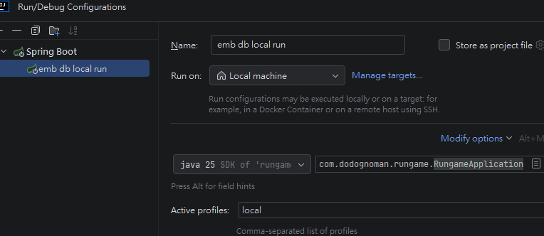

# Spring Boot 4.x · Java 25 · PostgreSQL

## 技術棧

| 元件 | 版本       | 說明 |
|------|----------|------|
| Spring Boot | 4.0.6    | AOT 支援 |
| Java | 25       | |
| PostgreSQL Driver | (BOM 管理) | |
| Hibernate | 6.x      | JPA 實作 |
| Flyway | (BOM 管理) | DB Migration |
| Testcontainers | (BOM 管理) | 整合測試 |

---

## 快速開始

### 前置需求

| 需求 |JDK 25，Docker|
|------|
| Docker & Docker Compose |

---

### Docker Compose + 外部 PostgreSQL

適合**主力本地開發**使用，資料持久化，環境最接近生產。

**1. docker up App And DB**

```bash
./mvnw.cmd clean package -DskipTests

docker compose up --build

```
**2. Springboot run**
可在intellij config 設定profile 參數
但須啟動DB


---

## 專案 Package 結構

以**功能**為主軸拆分 package，一個功能一個頂層 package。這裡的「功能」不限於業務功能，也包含系統功能：

- **業務功能**：例如 `user/`（使用者）、`score/`（分數）。
- **系統功能**：例如 `authjwt/`（JWT 驗證）、`filter/`（共用 Filter）。

好處是**找東西時依「功能」直覺定位**：要改 JWT 就看 `authjwt/`、要改分數就看 `score/`，相關的 Controller / Service / Entity 都集中在同一個 package 內，瀏覽與閱讀都直觀，不需要在 `controllers/`、`services/`、`repositories/` 之間來回跳。

> 下方僅為**示意**，列出主要 package 與代表性類別，並非完整檔案清單。

```
com.dodognoman.rungame
│
├── RungameApplication.java          # 啟動入口
│
├── user/                            # 業務功能：使用者（註冊 / 登入）
│   ├── UserController.java          #   REST 端點
│   ├── UserService.java             #   業務邏輯
│   ├── dto/                         #   進出 API 的 payload（RegisterRequest…）
│   └── repo/                        #   JPA Entity + Repository（User…）
│
├── score/                           # 業務功能：分數（更新 / 查詢 / 排行榜）
│   ├── ScoreController.java
│   ├── ScoreService.java
│   ├── dto/                         #   UpdateScoreRequest、LeaderboardEntry…
│   └── repo/                        #   Score、ScoreRepository
│
├── authjwt/                         # 系統功能：JWT 驗證
│   ├── JwtService.java              #   token 產生 / 驗證
│   ├── AuthInterceptor.java         #   攔截需驗證的請求
│   └── PassJwt.java                 #   標註免驗證端點的 annotation
│
├── frontendlog/                     # 系統功能：前端日誌落地
│   └── FrontendLogController.java
│
├── filter/                          # 系統功能：跨請求 Filter
│   ├── TraceIdFilter.java           #   產生 traceId 寫入 MDC
│   ├── PreventRepeatFilter.java     #   防短時間重複請求（429）
│   └── ActuatorAuthFilter.java      #   /actuator 簽章驗證
│
├── common/                          # 跨功能共用元件
│   ├── BaseEntity.java              #   共用 Entity 基底
│   ├── dto/ApiResponse.java         #   統一回應結構
│   ├── exception/                   #   ErrorCode、GlobalExceptionAdvice
│   └── util/ActuatorKeyGen.java     #   一次性金鑰產生工具
│
└── config/                          # 基礎設施配置（@Configuration）
    ├── JacksonConfig.java           #   Jackson 全域配置
    └── WebMvcConfig.java            #   攔截器 / MVC 註冊
```

### Package 拆分原則

| Package | 放什麼 |
|---------|--------|
| `{功能}/` | 該功能的進入點與邏輯（Controller、Service） |
| `{功能}/dto/` | Request / Response 物件，只做資料搬運，不含邏輯 |
| `{功能}/repo/` | JPA Entity 與 Repository，隱藏資料存取細節 |
| `common/` | 跨多個功能共用的服務、工具、回應結構與例外處理 |
| `config/` | Spring `@Configuration` 類，負責 Bean 宣告與環境初始化 |

新增功能時，以**功能名稱**建立新的頂層 package（業務如 `game/`、系統如 `audit/`），各自維護自己需要的 Controller / Service / dto / repo，避免跨功能直接相互依賴。

---

## 為什麼選 PostgreSQL？

在 Spring Boot 4.x + Java 25 這個組合下，PostgreSQL 是**支援度最高**的選擇：

1. Hibernate 6.x 對 PostgreSQL Dialect 的支援最完整
2. Flyway 的 `flyway-database-postgresql` 模組原生支援
3. 生態系成熟，社群資源豐富

---


## API 端點

```
全域 pre path /rungame
GET    /actuator/health           健康檢查
```

## 環境變數

| 變數 | 預設值 | 說明 |
|------|--------|------|
| `DB_HOST` | `localhost` | PostgreSQL 主機 |
| `DB_PORT` | `5432` | PostgreSQL 埠號 |
| `DB_NAME` | `rungame` | 資料庫名稱 |
| `DB_USER` | `postgres` | 使用者名稱 |
| `DB_PASS` | `postgres` | 密碼 |
| `JWT_SECRET` | `change-me-in-production-...` | JWT 簽章密鑰，正式環境**務必覆蓋**，至少 32 字元 |
| `ACTUATOR_PUBLIC_KEY` | （無，未設定時拒絕所有 actuator 請求） | actuator 驗簽用 ECDSA P-256 公鑰（Base64），見下方說明 |

---

## Actuator 端點保護

`/actuator/**` 不是用帳密保護，而是**ECDSA 簽章驗證**：呼叫端用私鑰對 timestamp 簽章，Server 用公鑰驗簽。即使封包被攔截，攻擊者沒有私鑰也無法偽造新請求。

由 [`ActuatorAuthFilter`](src/main/java/com/dodognoman/rungame/common/filter/ActuatorAuthFilter.java) 實作，採 **fail-closed**：若 `ACTUATOR_PUBLIC_KEY` 未設定或載入失敗，所有 actuator 請求一律被拒絕。

### 1. 產生金鑰對（ActuatorKeyGen）

用一次性工具 [`ActuatorKeyGen`](src/main/java/com/dodognoman/rungame/common/util/ActuatorKeyGen.java) 產生 ECDSA P-256 金鑰對：

```bash
./mvnw.cmd exec:java "-Dexec.mainClass=com.dodognoman.rungame.common.util.ActuatorKeyGen" "-Dexec.classpathScope=compile"
```

輸出兩把金鑰：

- **PUBLIC KEY** → 設定到 `ACTUATOR_PUBLIC_KEY`（或 `application.yaml` 的 `actuator.public-key`）。
- **PRIVATE KEY** → 交給呼叫端 App 保管，**絕對不要 commit / 不要傳送**。

### 2. 呼叫時帶上簽章 Header

| Header | 內容 |
|--------|------|
| `X-Timestamp` | 毫秒級 Unix epoch（`System.currentTimeMillis()`） |
| `X-Signature` | `Base64( ECDSA_SHA256_sign(timestamp 字串, 私鑰) )` |

timestamp 與當前時間誤差超過約 10 秒會被視為過期（防重放）。

---

## 日誌（Logging）

日誌格式由 [`logback-spring.xml`](src/main/resources/logback-spring.xml) 依 **Spring profile** 切換，所有 log 皆帶請求追蹤碼 `traceId`（由 [`TraceIdFilter`](src/main/java/com/dodognoman/rungame/common/filter/TraceIdFilter.java) 在每個請求寫入 MDC）。

| Profile | 輸出 | 用途 |
|---------|------|------|
| `local` / `default` | 彩色純文字 console（含 `[traceId]`） | 本地開發，人讀友善 |
| `gcp` | 結構化 JSON **寫到檔案** `/var/log/rungame/app.json`（每日滾動、保留 30 天） | 部署到 GCP，含 trace/span 關聯 |

> `traceId` 只在 **HTTP 請求執行緒**中有值；啟動階段或背景執行緒的 log 會是空的，屬正常現象。

### 本地開發

不帶 profile 即可（吃 `default`），console 為彩色文字：

```bash
./mvnw.cmd spring-boot:run
```

### 部署到 GCP

`gcp` profile 的 Cloud Logging 設定、Ops Agent 安裝、舊日誌清理等詳細步驟，請見 [reads/gcpdevelop.md](reads/gcpdevelop.md)。
