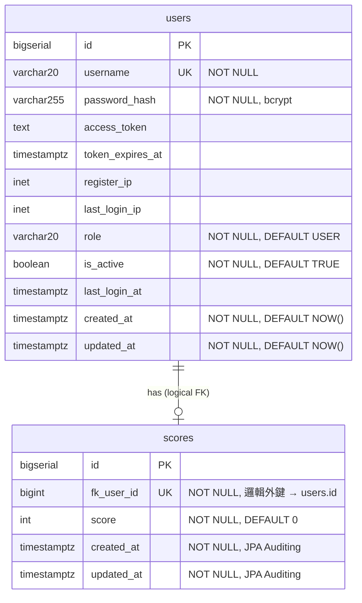

# Database ERD

資料表的關聯總覽。欄位細節見 [schema.md](schema.md)，設計取捨見 [decisions.md](decisions.md)。

## ER 圖

## 關聯說明

| 關聯 | 基數 | 說明 |
|------|------|------|
| `users` → `scores` | 1 : 0..1 | 每個 user **最多一筆**分數（`scores.fk_user_id` 唯一）；首次更新分數時才建立該筆紀錄。 |

### 重點

- **不建實體外鍵約束**：`scores.fk_user_id` 是**邏輯外鍵**，DB 端不產生 FK constraint（JPA `@JoinColumn` 設 `ConstraintMode.NO_CONSTRAINT`），關聯僅由應用層維護。理由見 [decisions.md](decisions.md)。
- **每 user 一筆分數（覆蓋制）**：`fk_user_id` 加 `UNIQUE`，分數採覆蓋而非歷史累積。
- JPA Entity `Score` 以 `@ManyToOne(fetch = LAZY)` 對應 `User`，撈 `Score` 不會一併載入 `User`。
